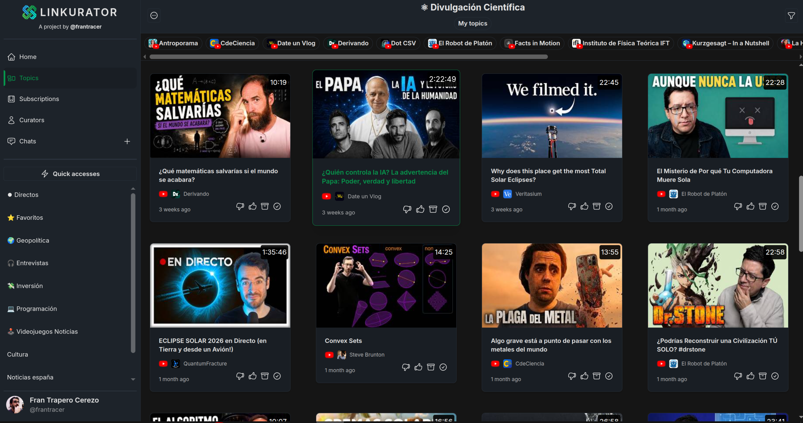

# Linkurator

Linkurator is a tool that helps you explore and categorize your subscriptions from content providers like YouTube, Spotify, Patreon, and RSS.




## Running the app

Requirements: [Docker and Docker Compose](https://docs.docker.com/engine/install/).

Bootstrap the configuration files `.config.json`/`.env` once with:
```bash
docker compose run --rm generate-env
```

Then start the application with:
```bash
docker compose up
```

- Frontend: http://localhost:3000
- API docs: http://localhost:9000/docs

Stop everything with:
```bash
docker compose down
```

## Building the app

To build the backend and frontend images from source, run:
```bash
docker compose build
```
